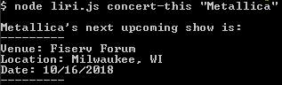

# Liri
Liri is a Node.js bot with commands that will pull data about movies, concerts, and songs from several APIs.

## Commands
Liri can perform the following commands:

### node liri.js concert-this "band name here"
  This command will search and display the entered band's next concert information.
  
 
 
 ### node liri.js spotify-this-song "song name here"
  This command will search and display information about the entered song.
  
  
  
  **Note** The search will display the first result that Spotify returns, based on the song's overall popularity on that app. You can make your search more specfific by including the name of the artist in the search term.
  
  For example, adding in "Drink Alestorm" to the above example gets us a different result:
  
  
  ### node liri.jsmovie-this "movie name here"
  This command searches the OMDB API for information about a film.
  
  
  
  ## node liri.ja do-what-it-says
  Just give it a try, eh? No second argument is needed.
